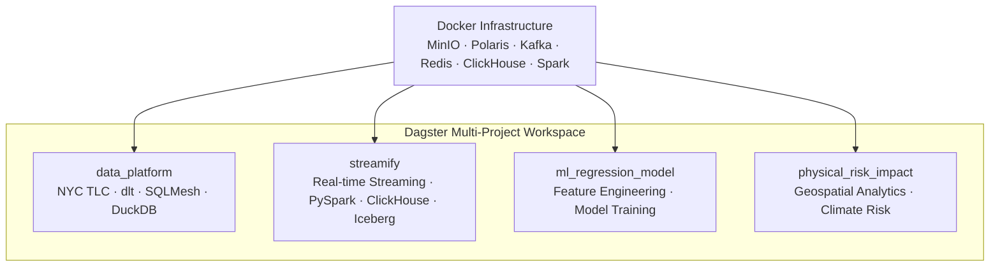
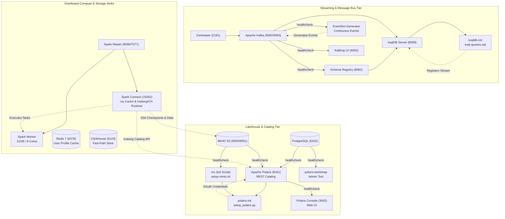

# Open Data Stack Platform

A modern, production-grade data platform demonstrating end-to-end data engineering, real-time streaming, dimensional modeling, machine learning, and geospatial analytics across a **multi-project Dagster workspace**.


## Monorepo Architecture & Projects

The platform is organized into four domain-specific projects orchestrated through a unified Dagster workspace (`dg.toml`), isolating project dependencies while enabling shared lineage, monitoring, and cross-project asset execution:


```mermaid
flowchart TD
    INFRA[Docker Infrastructure\nMinIO · Polaris · Kafka · Redis · ClickHouse · Spark]
    
    subgraph Projects [Dagster Multi-Project Workspace]
        P1[data_platform\nNYC TLC · dlt · SQLMesh · DuckDB]
        P2[streamify\nReal-time Streaming · PySpark · ClickHouse · Iceberg]
        P3[ml_regression_model\nFeature Engineering · Model Training]
        P4[physical_risk_impact\nGeospatial Analytics · Climate Risk]
    end

    INFRA --> P1
    INFRA --> P2
    INFRA --> P3
    INFRA --> P4
```

### Workspace Projects

| Project | Domain / Scope | Key Technologies | Description |
| :--- | :--- | :--- | :--- |
| [**`data_platform`**](./dagster-workspace/projects/data_platform) | NYC TLC Taxi Batch Analytics | `dlt`, `SQLMesh`, `dbt`, `DuckDB`, `Snowflake`, `Dagster` | Ingests, models, and transforms billions of NYC taxi records into dimensional data marts with monthly partition backfills. |
| [**`streamify`**](./dagster-workspace/projects/streamify) | Real-Time Music Streaming Ingestion | `Kafka`, `ksqlDB`, `PySpark 4.0`, `Redis`, `ClickHouse`, `Iceberg` | Enterprise streaming pipeline (500K events/s) with schema validation, Iceberg DLQ table, executor-side Redis enrichment, and dual ClickHouse/Iceberg sinks. |
| [**`ml_regression_model`**](./dagster-workspace/projects/ml_regression_model) | Machine Learning & Feature Engineering | `Bauplan` | Predictive modeling pipelines for fare estimation and trip duration analysis. |
| [**`physical_risk_impact`**](./dagster-workspace/projects/physical_risk_impact) | Climate & Geospatial Risk Analysis | `Polars`, `Geospatial libraries`, `Dagster` | Assessment and vulnerability modeling of physical asset risk against climate data. |


## Technology Stack & Tooling

- **Orchestration**: **Dagster** (`dg` multi-project workspace, Software-Defined Assets, Sensors, Partitions).
- **Transformations & Modeling**: **SQLMesh** virtual environments, column-level lineage)* & **dbt***.
- **Compute & Engines**: **PySpark 4.0 (Spark Connect)**, **Polars**, **DuckDB** (local OLAP), **ClickHouse** (real-time streaming OLAP), and **Snowflake** (production cloud warehouse).
- **Lakehouse & Storage**: **Apache Iceberg** table format, **Apache Polaris** REST Catalog, and **MinIO** S3-compatible object storage.
- **Streaming & Cache**: **Apache Kafka**, **Confluent Schema Registry**, **ksqlDB**, and **Redis 7**.
- **Package Management**: **`uv`** for fast, deterministic Python virtual environment and dependency management.


## Shared Infrastructure (`docker-compose.yml`)

The platform includes a root Docker Compose environment providing shared infrastructure services. Individual workspace projects consume only the services they require:

```bash
docker compose up -d
```

### Important Files

- `docker-compose.yml`: Services orchestration
- `dagster-workspace/dg.toml`: Dagster workspace configuration
- `opendata_stack_platform_dbt/dbt_project.yml`: dbt project settings
- `opendata_stack_platform_sqlmesh/config.yml`: sqlmesh project settings
- `.envrc` based  on the current setting the proper environment is initialized

### Access Points & Service URLs

| Service | Port / URL | Purpose |
| :--- | :--- | :--- |
| **Dagster UI** | `http://localhost:3000` | Unified data orchestration, asset lineage, and run monitoring |
| **Polaris Console** | `http://localhost:3002` | Web UI for Apache Polaris Iceberg catalog & namespace management |
| **Polaris REST API** | `http://localhost:8181` | REST Catalog API for Iceberg table operations |
| **MinIO Console** | `http://localhost:9001` | S3-compatible object storage management (`minioadmin` / `minioadmin`) |
| **Spark Master UI** | `http://localhost:8080` | Spark cluster management & active executor inspection |
| **Spark Connect** | `sc://localhost:15002` | Remote gRPC execution for PySpark streaming jobs |
| **ClickHouse HTTP** | `http://localhost:8123` | Fast-path analytical SQL query interface |
| **Kafdrop** | `http://localhost:9002` | Kafka topic, partition, and consumer lag inspector |
| **Schema Registry** | `http://localhost:8081` | Centralized Avro/JSON schema registry |
| **ksqlDB** | `http://localhost:8088` | Stream query processing & user profile generation |
| **Redis** | `localhost:6379` | In-memory caching for executor-side streaming lookups |

## Getting Started

### Shared Infrastructure

```bash
docker compose up -d
```

### Launch the Multi-Project Dagster Workspace

```bash
cd dagster-workspace
dg dev
```

Open `http://localhost:3000` to view and materialize assets across all four projects.

### Running Project-Specific Workflows

#### Execute SQLMesh transformations

```bash
cd ./opendata_stack_platform_sqlmesh
sqlmesh plan && sqlmesh run
```

#### Streamify Real-Time Ingestion
```bash
cd dagster-workspace/projects/streamify
uv sync && source .venv/bin/activate

# Run Redis cache seeding & streaming pipeline
python -m streamify.seed_redis
python -m streamify.main
```

### Infrastructure Architecture & Dependency Diagram


```mermaid
flowchart TD
    subgraph Lakehouse_Tier ["Lakehouse & Catalog Tier"]
        PG[("PostgreSQL (5432)")]
        MINIO[("MinIO S3 (9000/9001)")]
        MC["mc (Init Script)\nsetup-minio.sh"]
        POLARIS["Apache Polaris (8181)\nREST Catalog"]
        POL_BOOT["polaris-bootstrap\nAdmin Tool"]
        POL_INIT["polaris-init\nsetup_polaris.py"]
        POL_UI["Polaris Console (3002)\nWeb UI"]

        MINIO -->|healthcheck| MC
        PG -->|healthcheck| POL_BOOT
        PG & MINIO -->|healthcheck| POLARIS
        POLARIS & MC --> POL_INIT
        POLARIS -->|healthcheck| POL_UI
    end

    subgraph Streaming_Tier ["Streaming & Message Bus Tier"]
        ZK["Zookeeper (2181)"]
        KAFKA["Apache Kafka (9092/9093)"]
        SR["Schema Registry (8081)"]
        KSQL["ksqlDB Server (8088)"]
        KSQL_INIT["ksqldb-init\nksql-queries.sql"]
        ES["EventSim Generator\nContinuous Events"]
        KD["Kafdrop UI (9002)"]

        ZK --> KAFKA
        KAFKA -->|healthcheck| SR & ES & KD
        KAFKA & SR --> KSQL
        KSQL --> KSQL_INIT
    end

    subgraph Compute_Tier ["Distributed Compute & Storage Sinks"]
        SP_M["Spark Master (8080/7077)"]
        SP_W["Spark Worker\n12GB / 8 Cores"]
        SP_C["Spark Connect (15002)\nIvy Cache & Iceberg/CH Runtime"]
        REDIS[("Redis 7 (6379)\nUser Profile Cache")]
        CH[("ClickHouse (8123)\nFast-Path Store")]

        SP_M --> SP_W
        SP_M --> SP_C
    end

    ES -.->|Generates Events| KAFKA
    KSQL_INIT -.->|Registers Stream| KSQL
    POL_INIT -.->|OAuth Credentials| POLARIS
    SP_C -.->|Iceberg Catalog API| POLARIS
    SP_C -.->|S3A Checkpoints & Data| MINIO
    SP_C -.->|Executes Tasks| SP_W
```


### ⚙️ Deep Dive: Service Roles, Init Scripts & Side Effects

#### Lakehouse & Metadata Governance Tier
- **`postgres` (`polaris-postgres:5432`)**: Relational backend for Polaris storing realm metadata, principals, catalog permissions, and namespace hierarchies.
- **`minio` (`:9000` API, `:9001` Console)**: S3-compatible object storage hosting Iceberg Parquet data files, metadata trees, and streaming checkpoints.
- **`mc` (Init Script)**: Runs `setup-minio.sh` once MinIO is healthy to create S3 buckets (`lakehouse`, `datalake`, `checkpoints`) and provision `miniouser` credentials.
- **`polaris-bootstrap` (Side Effect)**: Runs `apache/polaris-admin-tool` to bootstrap root realm credentials in PostgreSQL.
- **`polaris` (`:8181` API, `:8182` Health)**: Quarkus-based Apache Polaris REST Catalog server for Iceberg table metadata and RBAC token dispensing.
- **`polaris-init` (Init Script)**: Executes `setup_polaris.py` to provision the `lakehouse` catalog, create the `streamify` namespace, and generate OAuth credentials into `polaris-config/polaris_credentials.env`.
- **`polaris-console` (`:3002`)**: Modern web interface to inspect Polaris catalogs, tables, schemas, and credentials.


#### Event Ingestion & Streaming Tier
- **`kafka` (`:9092` internal, `:9093` host) & `zookeeper` (`:2181`)**: Core distributed message log with partition key hashing.
- **`schema-registry` (`:8081`)**: Centralized Confluent Schema Registry for validating Avro/JSON event payloads.
- **`ksqldb-server` (`:8088`) & `ksqldb-init` (Init Script)**: `ksqldb-init` polls the ksqlDB server until ready, then executes `ksql-queries.sql` to derive the `user_profiles` Avro stream from `listen_events`.
- **`eventsim` (Event Producer)**: Simulates real-time Spotify-like playback traffic (2,500 simulated users across web/mobile) publishing to `listen_events`, `page_view_events`, and `auth_events`.
- **`kafdrop` (`:9002`)**: Web UI for monitoring Kafka topics, message contents, and consumer group lags.


#### Distributed Compute, Cache & Analytical Sinks
- **`spark-master` (`:8080`, `:7077`) & `spark-worker`**: Distributed Spark 4.0 cluster configured with 12 GB RAM and 8 cores, with pre-installed PyArrow, Redis, and ClickHouse drivers.
- **`spark-connect` (`:15002` gRPC, `:4041` UI)**:
  - **Ivy Cache Warm-up**: Pre-downloads runtime packages (`iceberg-spark-runtime-4.0`, `hadoop-aws`, `spark-sql-kafka`, `clickhouse-jdbc`, `dataflint`) during container startup.
  - **Catalog Config**: Connects directly to Polaris REST catalog (`http://polaris:8181/api/catalog`) with automatic OAuth token refresh and MinIO S3A endpoints.
- **`redis` (`:6379`)**: In-memory hash cache (`user:{userId}`) populated by `seed_redis.py` for micro-batch enrichment.
- **`clickhouse` (`:8123` HTTP, `:9009` Native)**: Analytical column-store with `ReplacingMergeTree` for sub-second streaming analytics.