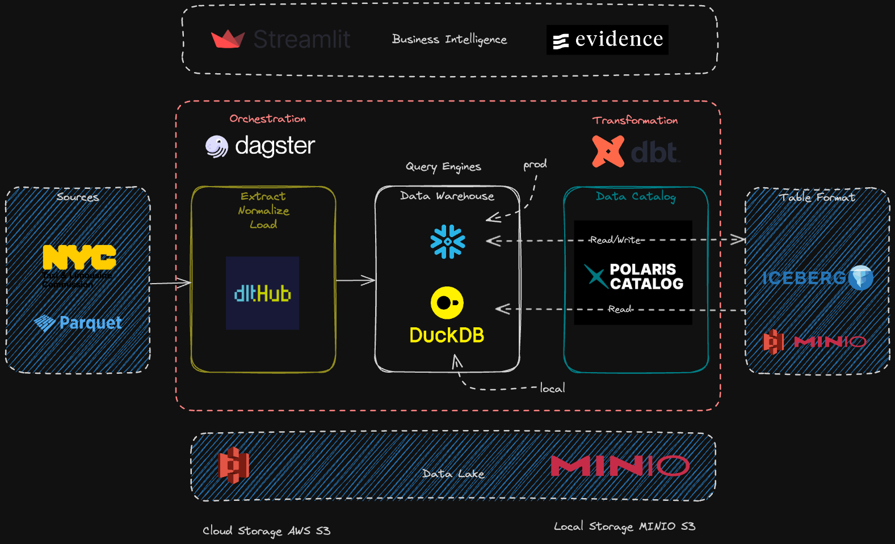

#  Opendata Stack: 🚕🗽  📊  NYC TLC Trip Record Data

## Overview



### Objective

Build a modern data analytics and machine learning platform that provides a scalable foundation for ingesting, transforming, and analyzing data. Using NYC taxi trip data as a practical example, this platform demonstrates how to build robust data pipelines with modern tooling.

### Scope

The solution covers the full data lifecycle—from extraction of raw datasets available on NYC’s Open Data portal, through transformation and storage, to advanced analytics and visualization. The system is designed as a Work In Progress (WIP) that will evolve through iterative enhancements.

### Business Process

#### Process Being Measured
Taxi and For-Hire Vehicle trips in NYC, segmented by Yellow Taxi, Green Taxi, and FHV data.

#### Goals

- Build a scalable data platform that enables rapid analytics development
- Implement robust data pipelines with built-in quality checks and monitoring
- Demonstrate end-to-end ML workflows from data ingestion to model deployment
- Create reproducible analytics that drive data-informed decision making
- Showcase modern data stack integration patterns and best practices

#### Platform Value

- **Technical Excellence**:
  - Production-ready data pipeline architecture
  - Scalable infrastructure patterns
  - Modern data stack integration examples
  - CI/CD and testing best practices
- **Business Intelligence**:
  - Advanced analytics workflows
  - ML-ready data foundations

#### Target Audience

- **Engineering Leaders**:
  - CTOs and Technical Directors
  - Data Engineering Leads
  - ML Engineering Teams
  - Platform Architects
  - Anyone interested in data engineering
- **Business Stakeholders**:
  - Data Analytics Teams
  - Product Managers

---

## Engineering Vision

This is a **Work In Progress (WIP)** project to visualize and analyze **NYC Taxi Trips** data using modern, open-source data tooling.

The primary goal of this project is to develop a **modern data stack pipeline** using the tools listed below. The design emphasizes:

- **Multi-Engine Stack**: Utilize **DuckDB** locally for fast prototyping and lightweight analysis, and **Snowflake** in production for scalability and performance.
- **Open Table Formats**: Incorporate **Delta Lake** or other open table formats to ensure compatibility, flexibility, and performance.
- **Open Catalogs**: Leverage **open metadata catalogs** for better discoverability, governance, and interoperability.


### 🧰 Tools Planned

- **Orchestration**: [**Dagster**](https://github.com/dagster-io/dagster) To orchestrate and monitor the pipeline, ensuring tasks are executed reliably and dependencies are managed effectively.
- **Data Warehouse**:
    - [**DuckDB**](https://github.com/duckdb/duckdb): A high-performance SQL OLAP engine for local and small-scale analysis.
    - **Snowflake**: For production-scale analytics, providing scalability and enterprise-grade performance.
- **Extract & Load**: [**dlt**](https://github.com/dlt-hub/dlt) To extract raw data from NYC’s Open Data portal (Yellow, Green, and HVFHV taxi trips) and load it into the data warehouse.
- **Transform**: [**dbt**](https://github.com/dbt-labs/dbt-core) For building modular, reusable, and version-controlled transformations in SQL, enabling robust data modeling of NYC Taxi data.
- **Business Intelligence (BI)**: [**Evidence**](https://github.com/evidence-dev/evidence) A modern, lightweight BI tool for creating visually appealing and shareable reports about taxi trips and trends.

---

## 🚀 Quick Start

### Infrastructure Services

Start all services with Docker Compose:

```bash
docker-compose up -d
```

This starts:
- **MinIO** (S3-compatible storage): Ports 9000 (API), 9001 (Console)
- **Apache Polaris** (Iceberg catalog): Ports 8181 (API), 8182 (Management)
- **Polaris Console** (Web UI): Port 3001
- **Kafka + Zookeeper**: Port 9092 (broker)
- **Spark** (Master + Worker + Connect): Ports 8080 (UI), 7077 (Master), 15002 (Connect)
- **Eventsim** (Event generator): Generates streaming events to Kafka

### Access Points

| Service | URL | Description |
|---------|-----|-------------|
| Polaris Console | http://localhost:3001 | Web UI for Apache Polaris catalog management |
| Polaris API | http://localhost:8181 | REST API for Iceberg catalog operations |
| MinIO Console | http://localhost:9001 | S3 storage web interface (minioadmin/minioadmin) |
| Spark Master UI | http://localhost:8080 | Monitor Spark cluster and jobs |
| Dagster UI | http://localhost:3000 | Orchestration and pipeline monitoring |

### Polaris Console

The Polaris Console provides a modern web interface for managing Apache Polaris:
- Browse catalogs, namespaces, and tables
- View table schemas and metadata
- Manage access policies and principals
- Monitor catalog operations

**Login Credentials**: Use the OAuth credentials from `dagster-workspace/team_ops/.env.polaris`

---

## Architecture

### Streaming Data Flow

```
Eventsim → Kafka → Spark Streaming → Iceberg (via Polaris) → MinIO
                        ↓
                   Dagster (Orchestration)
```

### Key Components

- **Eventsim**: Generates realistic user activity events
- **Kafka**: Event streaming platform
- **Spark Connect**: Remote Spark execution without subprocess overhead
- **Apache Polaris**: Open-source Iceberg REST catalog with governance
- **MinIO**: S3-compatible object storage for Iceberg data files
- **Dagster**: Data orchestration and monitoring

For detailed architecture diagrams, see:
- [Streaming Architecture](./docs/streamify-architecture.md)
- [Kafka Architecture](./docs/kafka-architecture.md)
- [Implementation Guide](./docs/STREAMIFY_IMPLEMENTATION.md)
