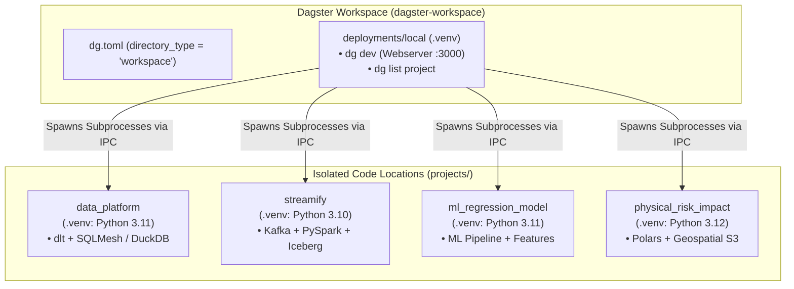

# Dagster Multi-Project Workspace

## Workspace Architecture & Layout

This directory is configured as a **Dagster Multi-Project Workspace**. A multi-project workspace allows multiple isolated Dagster projects—each maintaining its own Python version, dependencies, and virtual environment—to be discovered, validated, and run simultaneously under a single Dagster webserver (`dg dev` / Dagster UI) or the `dg` CLI.

### Process Isolation Model



- When `dg dev` runs from `dagster-workspace`, the host process uses `deployments/local/.venv` to coordinate the webserver.
- For each project defined in `dg.toml`, Dagster spawns an isolated subprocess using that project's specific `.venv` and communicates over an IPC/API layer.


## Workspace vs. Project Command Scopes

**Strict Environment Isolation**:

- **Workspace commands** (`dg dev`, `dg list project`, `dg plus ...`) MUST be run from the workspace root (`dagster-workspace/`) using `deployments/local/.venv`.
- **Project commands** (`dg list defs`, `dg check defs`, `dg scaffold ...`, `dg launch ...`, `pytest`) MUST be run from within the specific project directory (`projects/<name>/`) using that project's `.venv`.

### Workspace-Level Commands

Always execute from `dagster-workspace/`:

```bash
# Activate the local deployment environment
source deployments/local/.venv/bin/activate

# 1. Start unified Dagster dev server (spawns all projects at http://localhost:3000)
dg dev

# 2. List all registered projects in the workspace
dg list project

# 3. Alternative without activating virtual environment:
uv run --project deployments/local dg dev
uv run --project deployments/local dg list project
```

### Project-Level Commands

Always execute from `dagster-workspace/projects/<project_name>/`:

```bash
cd projects/data_platform
source .venv/bin/activate

# List assets, checks, resources, schedules, and sensors in the project
dg list defs

# Validate configuration and definition integrity
dg check defs

# Scaffold new definitions or components
dg scaffold defs dagster.asset --name my_new_asset

# Materialize specific assets via CLI
dg launch --assets taxi/fact_taxi_trip

# Run project unit tests
pytest

# Alternative using uv without manual activation:
uv run --project projects/data_platform dg list defs
uv run --project projects/data_platform pytest
```


## Environment Bootstrapping (`uv`)

> [!WARNING]
> **Virtual environments are NOT installed or synced automatically by `dg`!**
>
> You might expect `dg dev` or workspace commands to automatically provision child project environments, but `dg` does not create them by default. You **must manually create and sync the virtual environment** (`.venv`) in `deployments/local` and in every project directory under `projects/` using `uv sync`. If you do not manually initialize the environments for each project, Dagster code locations will fail to load and you will encounter execution errors.

Every project and deployment has its own `uv.lock` and `.venv`. Always use `uv` for package management. Never install packages globally.

Initial Setup / Full Workspace Synchronization. Run from `dagster-workspace/`:

```bash
# 1. Sync local workspace deployment environment
cd deployments/local && uv sync && cd ../..

# 2. Sync all project environments
cd projects/data_platform && uv sync && cd ../..
cd projects/streamify && uv sync && cd ../..
cd projects/ml_regression_model && uv sync && cd ../..
cd projects/physical_risk_impact && uv sync && cd ../..
```