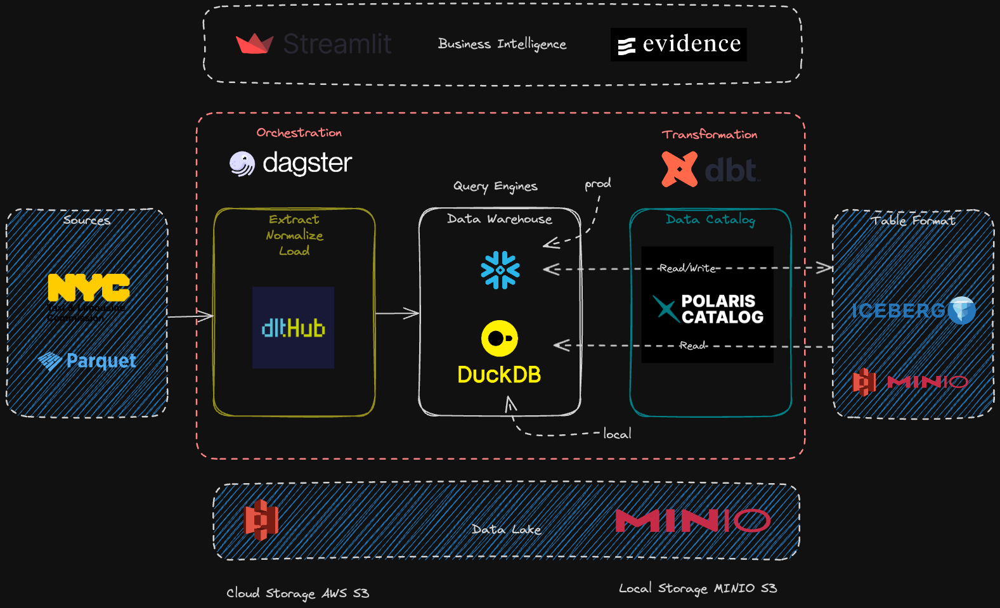

# NYC TLC 🚕🗽📊 Data Platform



## Overview & Business Scope

The **NYC TLC Data Platform** is an enterprise-grade batch analytics platform built on Modern Data Stack. It ingests, validates, models, and analyzes billions of trip records from the New York City Taxi and Limousine Commission (NYC TLC).

The platform manages the complete data lifecycle:

- **Datasets**: Yellow Taxi, Green Taxi, For-Hire Vehicle (FHV), High-Volume FHV (Uber/Lyft), and Taxi Zone geospatial lookup tables.
- **Storage & Warehouse**: Dual-engine support using **DuckDB** for fast local execution and **Snowflake** for production-scale analytical workloads.
- **Transformations**: **SQLMesh** for virtual data environments, column-level lineage, and automated plans, with **dbt (Legacy)** maintained for backwards compatibility.
- **Orchestration**: Fully managed via **Dagster** assets with monthly temporal partitioning and data quality checks.


## Architecture & Technology Stack

| Layer | Technology | Service / Port | Purpose |
| :--- | :--- | :--- | :--- |
| **Ingestion / Extract** | `dlt` / Python (Polars & Requests) | — | Extracts raw Parquet and CSV files from NYC Open Data into S3/MinIO lake storage. |
| **Object Storage** | MinIO (S3) | `minio:9000` / `localhost:9000` | S3-compatible object storage hosting raw monthly trip files and zone reference tables. |
| **Data Warehouse** | DuckDB / Snowflake | Local / Cloud | Columnar OLAP engines powering analytical queries and dimensional models. |
| **Transformations)** | **SQLMesh** | Local / CLI | Preferred transformation framework providing virtual environments, plan automation, and CI/CD testing. |
| **Orchestration** | Dagster | `localhost:3000` | Software-defined asset graph, monthly partition backfills, and pipeline monitoring. |


## Asset Groups & Transformation Layers

### Asset Groups
- **`raw_files`**: S3/MinIO downloads from the NYC Open Data portal, partitioned monthly (`YYYY-MM-01`).
- **`ingestion` / `dlt`**: Automatic schema inference, evolution, and loading into the target data warehouse.
- **`sqlmesh`** (`opendata_stack_platform_sqlmesh`): Production dimensional modeling, column-level lineage, and incremental models.
- **`dbt`** *(Legacy)*: Legacy dimensional modeling (`opendata_stack_platform_dbt`).

## Setup & Execution

Use `.env.example.local` for local DuckDB/MinIO runs, or `.env.example.prod` for Snowflake/AWS E2E runs (pre-provision via `infrastructure/`).

### Option A: Local Dev (DuckDB + MinIO)

```bash
# 1. Start storage
docker compose up -d minio mc

# 2. Configure env
cp .env.example.local .env

# 3. Launch Dagster UI (http://localhost:3000)
cd dagster-workspace && dg dev
```

### Option B: Production (Snowflake + AWS) Running DG Server Locally

```bash
# 2. Configure env
cd ../dagster-workspace/projects/data_platform
cp .env.example.prod .env

# 1. Provision AWS & Snowflake resources
cd infrastructure && terraform init && terraform apply

# 3. Launch Dagster UI (http://localhost:3000)
cd ../.. && dg dev
```
