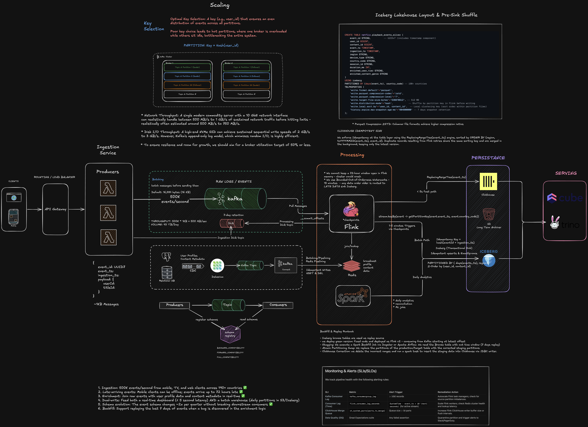
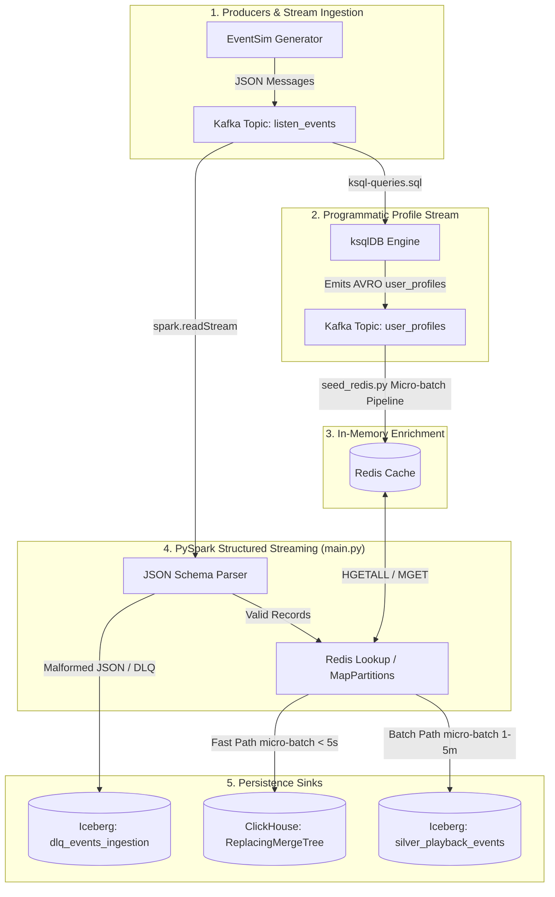

# Streamify: Real-Time Event Ingestion & Enrichment Platform

## Overview & System Objectives
**Streamify** is an enterprise streaming data platform designed to model high-throughput event ingestion (e.g., Spotify/Netflix playback streams). The system ingests raw event streams from Kafka, performs real-time data enrichment against in-memory Redis caches, enforces schema validation and Dead Letter Queues (DLQ), and persists data across a dual-sink architecture:
- **Fast-Path Analytical Store (ClickHouse)**: Near real-time analytics (< 5s latency) using `ReplacingMergeTree` for deduplication.
- **Transactional Lakehouse (Apache Iceberg)**: Durable, partitioned Parquet lakehouse storage managed via Apache Polaris Catalog and MinIO S3.

### System Requirements & Design Goals

- [ ] **High-Throughput Ingestion**: Ingest up to 500K events/sec across global clients (mobile, TV, web).
- [ ] **Late-Arriving Events**: Handle out-of-order and offline mobile events arriving up to 72 hours late without data loss.
- [ ] **Low-Latency Enrichment**: Join raw event streams in real time with Redis user profiles and static content metadata.
- [ ] **Dual Persistence**: Feed real-time analytical dashboards (< 5s latency via ClickHouse) while maintaining a durable ACID Lakehouse (Iceberg on S3).
- [ ] **Zero-Downtime Schema Evolution**: Support backward/forward schema changes without breaking downstream consumers.
- [ ] **Reprocessing & Backfill**: Support offset replay and Lakehouse time-travel across a 7-day window for pipeline recovery.

## Key Technology Stack & Infrastructure

| Layer | Technology | Service / Port | Purpose |
| :--- | :--- | :--- | :--- |
| **Producer** | EventSim | `eventsim` | Simulates high-throughput streaming events (`listen_events`, `page_view_events`, `auth_events`). |
| **Message Broker** | Apache Kafka | `kafka:9092` / `localhost:9093` | Distributed log stream with partition key hashing. |
| **Profile Generation** | ksqlDB | `ksqldb-server:8088` | Creates programmatic `user_profiles` Avro stream from raw events. |
| **Schema Registry** | Confluent Schema Registry | `schema-registry:8081` | Centralized schema management and Avro/JSON schema validation. |
| **Cache / Enrichment** | Redis 7 | `redis:6379` | In-memory lookup store for user profiles and metadata. |
| **Stream Processing** | PySpark Structured Streaming | `spark-connect:15002` / `spark-master:7077` | Schema parsing, watermark handling, Redis enrichment, and dual-sink writes. |
| **Analytical Store** | ClickHouse | `clickhouse:8123` | Real-time query engine with `ReplacingMergeTree` table engine. |
| **Table Format** | Apache Iceberg | — | Open table format providing ACID transactions, partition evolution, and snapshot isolation. |
| **Lakehouse Catalog** | Apache Polaris | `polaris:8181` / `localhost:8181` | Centralized REST catalog managing table metadata, namespaces, and access control. |
| **Object Storage** | MinIO (S3) | `minio:9000` / `localhost:9000` | S3-compatible object storage hosting Parquet data files and streaming checkpoints. |
| **Orchestration** | Dagster | `localhost:3000` | Data pipeline orchestration, asset definitions, sensors, and quality checks. |

## Data Flow & Pipeline Architecture

## Stream Topics

> 📌 **Prerequisite**: `eventsim` requires `eventsim/target/eventsim-assembly-2.0.jar` to be built prior to running `docker compose up`. See [eventsim/README.md](./eventsim/README.md#building-eventsim-assembly-20jar-manually) for instructions.

Eventsim generates the following streams:

- **`listen_events`**: Primary high-throughput playback stream (tracks, users, device metadata).
- **`page_view_events`**: User navigation events across the application.
- **`auth_events`**: User authentication, registration, and status change events.
- **`user_profiles`**: Stream of user profile state derived via ksqlDB.

## Core Components

- **Stream Processing (`src/streamify/main.py`)**: PySpark Structured Streaming engine connecting to Kafka, executing Redis micro-batch lookups, managing watermarking, and writing concurrently to ClickHouse and Iceberg.
- **Cache Seeding (`src/streamify/seed_redis.py`)**: Async consumer consuming `user_profiles` and populating Redis hash tables (`user:{userId}`).

## OLTP database $\rightarrow$ Kafka $\rightarrow$ Redis

> **Enterprise Scale Simulation**: Simulates CDC pipeline where user profile updates flow from an OLTP database $\rightarrow$ Kafka $\rightarrow$ Redis.

In a production enterprise:

1. User registration, profile updates, and subscription changes occur in an OLTP database (e.g., PostgreSQL, Cassandra).
2. **Debezium (CDC)** captures row-level changes and publishes them to a compacted Kafka topic (user_profiles).
3. **Kafka Connect (Redis Sink**) streams updates into Redis in near real-time.

In the platform, because we don't want to manage the operational overhead of running `PostgreSQL` + `Debezium` locally, `ksqlDB` derives the profile stream, and `seed_redis.py` acts as the consumer populating `Redis`. The functional outcome is identical.

### Why External In-Memory Cache (Redis) over Native Stream Joins?

- **Avoids JVM OOM**: At scale (300M+ users $\approx$ 150GB+ profile state), Spark `broadcast()` joins would exhaust executor heap memory.
- **Partition-Level Micro-Batching**: PySpark leverages `mapInArrow` with pipelined `HMGET` queries to fetch batch-deduplicated profiles in a single network round-trip per partition.