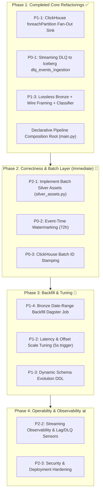

# Streamify — MVP Production-Readiness Specification

> **Status**: Updated — snapshot refactoring baseline (September 2026)
> **Scope**: Production-readiness roadmap reflecting the modern declarative speed layer, lossless Bronze, Schema Registry framing, drift classification, and remaining batch/scale milestones.
> **Companion**: [`specification.md`](./specification.md) describes the target system architecture; this doc is the actionable delta between today's codebase and that target.

---

## 1. Context & Guiding Principle

Streamify simulates an enterprise real-time event pipeline (500K events/sec, 190+ countries, 72h late arrivals, dual-write to a real-time dashboard and a batch warehouse).

**Guiding principle:** _This is an MVP project. It will not actually push 500K events/sec on a single laptop. But the code must be shaped so that the only thing between us and that scale is hardware — not architectural retrofit._

Concretely that means:

- No design decision that is a _ceiling below failure at scale_ (single-process write paths, global locks, unbounded memory) left unmarked.
- Configuration knobs (`trigger_interval`, `max_offsets_per_trigger`) are centralized in [`StreamingJobConfig`](../src/streamify/defs/resources.py) and _tunable toward_ production targets without code rewrites.
- Every invariant is written so CI/test suites can verify correctness without live cluster infrastructure.

### Reality Check (Honest Metrics Status)

| Metric | Target | Current State (Codebase) | Status & Next Blocker |
| :--- | :--- | :--- | :--- |
| **Ingestion Rate** | 500K events/s | Tunable via [`StreamingJobConfig.max_offsets_per_trigger`](../src/streamify/defs/resources.py) (default `100_000`) | Config-bounded; tuning formula documented in §4 (P1-2). |
| **Dashboard Latency** | < 5s | ClickHouse `trigger_interval` defaults to `10 seconds` ([`resources.py`](../src/streamify/defs/resources.py)) | Need default lowering to `5 seconds` at steady state (P1-2). |
| **Late Events** | 72h | Unbounded append (no watermark applied yet) | Needs `.withWatermark("event_ts", "72 hours")` — see §4.2 (P0-2). |
| **Write Parallelism** | Distributed Fan-out | **Unblocked ✅** — executor-side `foreachPartition` with cached `clickhouse-connect` clients ([`ClickHouseSink`](../src/streamify/resources.py)) | Done! Micro-batch writes now scale linearly across worker partitions. |
| **Dead-Letter Queue** | Lossless DLQ | **Implemented ✅** — PERMISSIVE decode routes unparseable records to Iceberg `dlq_events_ingestion` | Ingestion DLQ operational; batch quarantine routing in progress. |

---

## 2. Current-State Inventory (Verified Against `src/streamify/`)

### Implemented ✅

| Area | Location | Architectural Implementation |
| :--- | :--- | :--- |
| **Composition Root & Query Lifecycle** | [`main.py`](../src/streamify/main.py) | `StreamifyDeclarativePipeline` decoupling source, transform, and sink strategies via protocols (`StreamingSource`, `StreamTransformer`, `StreamingSink`). Supervised via `supervise_streaming_queries`. |
| **Lossless Bronze Landing** | [`transformations/events.py`](../src/streamify/transformations/events.py), [`schemas.py`](../src/streamify/schemas.py) | `project_bronze_events` stores untouched Kafka bytes (`raw_value: BinaryType`), `wire_format`, and `schema_id` into Iceberg `bronze_<topic>` partitioned by `_ingest_date`. Lossless schema-on-read foundation. |
| **Wire-Format Framing** | [`wire.py`](../src/streamify/wire.py) | JVM-native expressions (`schema_id_column`, `payload_column`, `is_confluent_framed`) extracting 5-byte Confluent headers (magic byte `0x00` + 4-byte schema id) without Python UDF overhead. |
| **Schema Registry Resolver** | [`schema_registry.py`](../src/streamify/schema_registry.py) | `ConfluentSchemaResolver` with LRU caching (`schemas_by_id`, `latest_by_subject`) and resilient degradation during registry outages. Dynamic wire-format configuration via `StreamSchemaConfig`. |
| **Dead-Letter Queue (Ingestion)** | [`transformations/events.py`](../src/streamify/transformations/events.py), [`schemas.py`](../src/streamify/schemas.py) | PERMISSIVE decode mode captures corrupt records in `_corrupt_record`; `route_corrupt_records` writes unparseable payloads directly to Iceberg `dlq_events_ingestion` partitioned by `_processing_date` (satisfies invariant: Iceberg DLQ table, not Kafka). |
| **Schema Drift Classification** | [`classification.py`](../src/streamify/classification.py) | `classify_raw_events` splits raw events into `READY`, `DRIFT` (retryable churn), and `MALFORMED` via key fingerprints (`field_fingerprint`), targeting the batch silver pipeline. |
| **ClickHouse Distributed Fan-Out** | [`resources.py`](../src/streamify/resources.py) | `ClickHouseSink.write_batch` dispatches parallel partition writes via `projected_df.foreachPartition(_write_partition)` using worker-cached clients (`get_executor_clickhouse_client`). Single-process collection eliminated. |
| **Redis Profile Enrichment** | [`transformations/events.py`](../src/streamify/transformations/events.py), [`resources.py`](../src/streamify/resources.py) | `RedisProfileEnricher` uses PyArrow `mapInArrow` and pipelined batch lookups against cached Redis client (`get_executor_redis_client`) with vector alignment (`align_batch_with_redis_profiles`). |
| **Content Metadata Broadcast Join** | [`resources.py`](../src/streamify/resources.py) | `SongsMetadataEnricher` loads and caches static songs catalog from S3 and performs broadcast left-join on `artist` and `song`. |
| **Storage & DDL Bootstrap** | [`bootstrap.py`](../src/streamify/bootstrap.py) | Idempotently creates namespaces and tables: ClickHouse `silver_playback_events` (`ReplacingMergeTree(event_ts)`), Iceberg `bronze_<topic>`, `silver_<topic>`, `dlq_events_ingestion`, and `quarantine_schema_drift`. |
| **Redis Seeding Worker** | [`seed_redis.py`](../src/streamify/seed_redis.py) | Async Kafka consumer for `user_profiles` Avro topic, pipelined `HSET` flushes to `user:<userId>`, and offset commits upon flush completion. |
| **Executor Client Caching** | [`resources.py`](../src/streamify/resources.py), [`clients.py`](../src/streamify/clients.py) | `@cache` singletons for Redis and ClickHouse clients scoped per worker process, preventing driver socket serialization issues. |

### Missing / In Progress 🚧

| Area | Current State | Target & Required Action |
| :--- | :--- | :--- |
| **Batch Silver Layer** | [`defs/silver_assets.py`](../src/streamify/defs/silver_assets.py) is a stub (`# TODO:`) | Implement Dagster batch assets consuming `bronze_<topic>`, executing `classification.classify_raw_events`, merging valid records into `silver_<topic>`, and parking drift in `quarantine_schema_drift`. |
| **Watermarking / Late Data** | No watermark applied in `add_event_metadata` or streaming queries | Add `.withWatermark("event_ts", "72 hours")` to guarantee deterministic state expiration and correct event-date routing (P0-2). |
| **ClickHouse Idempotency Stamping** | `batch_id` logged in `write_batch` ([`resources.py`](../src/streamify/resources.py)), but rows are unstamped | Add `_batch_id` and `_batch_ts` columns to ClickHouse table schema and projection to guarantee deterministic re-drive convergence (P0-3). |
| **Dynamic Schema Evolution DDL** | Hardcoded schemas in [`schemas.py`](../src/streamify/schemas.py); static Iceberg tables | Integrate `ALTER TABLE ... ADD COLUMN` triggers when new fields appear from Confluent Schema Registry (P1-3). |
| **First-Class Backfill Job** | Manual reset of Kafka offsets required | Build a parameterized Dagster job/sensor reading from `bronze_<topic>` over specific date ranges with separate checkpoints (P1-4). |
| **Pipeline Observability** | Dagster [`sensors.py`](../src/streamify/defs/sensors.py) tracks only Kafka lag | Instrument per-batch row counts, write latency, and DLQ drop counters into Dagster asset metadata and alerts (P2-2). |

---

## 3. Non-Functional Requirements (Target vs Actual)

| # | NFR | Target | Current Status | Verification Method |
| :--- | :--- | :--- | :--- | :--- |
| **N1** | Throughput Cap | ≥ 100K events/s sustained across workers (tunable to 500K/s) | **Architecture Ready**: `foreachPartition` distributed write avoids driver bottleneck | Multi-partition load test with high-volume Kafka mock |
| **N2** | Dashboard Latency | p95 event → ClickHouse visible < 5s | Configurable (`clickhouse_trigger_interval=10s`); needs 5s default | Timing micro-batch completion in ClickHouse system tables |
| **N3** | Exactly-Once / Dedup | Deduplication on `(event_id)` merge key; idempotent replays | `ReplacingMergeTree(event_ts)` active; row batch stamping pending | Duplicate batch injection test verifying identical row count |
| **N4** | Late Data Handling | Events up to 72h late land in correct partition, never dropped | Lossless Bronze preserves all; streaming watermark not yet active | Inject 72h-delayed event; verify presence in target date partition |
| **N5** | Schema Evolution | New fields flow without breaking consumers; drift quarantined | Bronze & Wire framing in place; drift classification ready for batch silver | Schema evolution test: produce v2 payload and inspect quarantine table |
| **N6** | Failure Handling | Corrupt records route to DLQ; stream never crashes | **Implemented**: Ingestion errors land in Iceberg `dlq_events_ingestion` | Corrupt JSON fuzzing test verifying zero stream interruption |
| **N7** | Observability | Per-topic lag, batch throughput, write duration visible | Partial (lag sensor only); streaming metadata not reported | Dagster asset materialization metadata check |
| **N8** | Testability | Decoupled core business logic; injectable clients | **Implemented**: Pure functions in `wire.py`, `classification.py`, mocked tests in CI | `uv run pytest` runs in < 1s with 100% mocked dependencies |

---

## 4. Work Packages

Priority: **P0** Correctness & Data Safety · **P1** Scale-Shaping · **P2** Operability & Polish.

### P0-1 — Dead-Letter Queue (DLQ) & Quarantine Architecture
- **Status:** **Streaming Ingestion DLQ Done ✅; Batch Quarantine In Progress ⏳**
- **Accomplished:**
  - `transformations/events.py:decode_raw_events` parses JSON with `mode="PERMISSIVE"` and captures corrupt bytes in `_corrupt_record`.
  - `route_corrupt_records` splits micro-batches into clean events and DLQ events.
  - `main.py` writes corrupt records to Iceberg `DLQ_TABLE` (`dlq_events_ingestion`) concurrently with ClickHouse and Bronze sinks.
  - `classification.py` defines schema churn vs malformed classifications.
- **Remaining Scope:**
  - Handle executor-side enrichment exceptions (e.g. Redis connection timeout) by routing to DLQ with appropriate `error_stage="enrichment"`.
  - Add integration tests verifying corrupt records land in `dlq_events_ingestion`.

### P0-2 — Watermarking & Bounded Event-Time State
- **Status:** **Pending ⏳**
- **Why:** Events arriving up to 72 hours late must land in the correct `event_date` partition in Iceberg and ClickHouse without allowing unbounded state accumulation.
- **What to Do:**
  - Add `.withWatermark("event_ts", "72 hours")` in [`add_event_metadata`](../src/streamify/transformations/events.py) or [`main.py`](../src/streamify/main.py).
  - Retain append-mode land-by-event-time semantics (no window aggregations) so late records append to the historical day partition.
  - Document the explicit contract: ClickHouse dashboard displays late-arriving events as facts; query results reflect end-state accuracy.
- **Acceptance:** Inject events with `now - 71h` timestamps; verify they land in the corresponding historical partition in Iceberg and appear in ClickHouse with original `event_ts`.

### P0-3 — Idempotent ClickHouse Writes (`batch_id` Stamping)
- **Status:** **In Progress ⏳**
- **Why:** When Spark micro-batches fail and retry, `foreachPartition` can re-insert records. `ReplacingMergeTree` merges duplicates asynchronously, but deterministic querying requires explicit batch versioning.
- **What to Do:**
  - Pass `batch_id` from `ClickHouseSink.write_batch` into the partition write transformation.
  - Stamp rows with `_batch_id` and `_batch_ts`.
  - Update `silver_playback_events` DDL in [`bootstrap.py`](../src/streamify/bootstrap.py) to incorporate `_batch_id` or ensure `event_ts` versioning handles same-second re-insertions deterministically.
- **Acceptance:** Replay an identical Spark micro-batch ID twice; verify final ClickHouse table state matches a single execution.

### P1-1 — Remove the Single-Process Write Ceiling (ClickHouse Fan-Out)
- **Status:** **COMPLETED ✅**
- **Accomplished:**
  - Eliminated driver-side `toArrow()` and single-client `insert_arrow()` bottlenecks.
  - Implemented `projected_df.foreachPartition(_write_partition)` in [`ClickHouseSink.write_batch`](../src/streamify/resources.py).
  - Worker tasks use `@cache`d worker-local `clickhouse-connect` clients (`get_executor_clickhouse_client`) with clean closure serialization.
  - Sinks now scale write throughput directly with Spark worker partition count.

### P1-2 — Scale-Tunable Trigger & Offset Configuration
- **Status:** **In Progress ⏳**
- **Why:** Latency and throughput knobs are centralized in [`StreamingJobConfig`](../src/streamify/defs/resources.py), but production defaults need tuning.
- **What to Do:**
  - Change default `clickhouse_trigger_interval` from `10 seconds` to `5 seconds` for true sub-5s dashboard latency.
  - Tune `max_offsets_per_trigger` defaults and document the sizing equation:
    $$\text{max\_offsets\_per\_trigger} \ge \text{target\_rate} \times \text{trigger\_interval\_seconds}$$
    *(e.g., $100\text{K events/s} \times 5\text{s} = 500\text{K offsets/trigger}$ on multi-worker clusters).*
- **Acceptance:** Pipeline runs locally with lightweight defaults and scales to target throughput via `.env` overrides without code changes.

### P1-3 — Schema Evolution via Schema Registry & Lossless Bronze
- **Status:** **Phase 1 Done ✅; Phase 2 (Batch Silver) In Progress ⏳**
- **Accomplished:**
  - `wire.py`: Confluent wire framing parsed via native Spark SQL expressions.
  - `schema_registry.py`: `ConfluentSchemaResolver` with LRU caching.
  - `schemas.py` & `bootstrap.py`: `BRONZE_SCHEMA` preserves raw Kafka bytes (`raw_value`), `wire_format`, and `schema_id`.
  - `classification.py`: Detects `READY`, `DRIFT` (schema churn), and `MALFORMED` payloads.
- **Remaining Scope:**
  - Wire `classification.classify_raw_events` into [`defs/silver_assets.py`](../src/streamify/defs/silver_assets.py).
  - Add dynamic schema migration (`ALTER TABLE ... ADD COLUMN`) for Iceberg/ClickHouse tables when backwards-compatible schema evolutions occur.

### P1-4 — First-Class Backfill & Replay Job (Req 6)
- **Status:** **Pending ⏳**
- **Why:** Replaying historical data currently requires manual offset tampering or wiping checkpoints.
- **What to Do:**
  - Create a dedicated Dagster asset/job (`silver_replay_job`) that reads from `bronze_<topic>` over a specified `_ingest_date` range.
  - Run the batch silver classification and enrichment pipeline using a dedicated checkpoint.
  - Use Iceberg `MERGE INTO` keyed on `event_id` to make re-runs converge rather than duplicate.
- **Acceptance:** Introduce an enrichment fix, re-run silver batch for the last 7 days; verify corrected records in Iceberg and ClickHouse with zero duplicates.

### P2-1 — Batch Layer Completion: Silver Assets & Quarantine Routing
- **Status:** **In Progress ⏳**
- **Why:** [`defs/silver_assets.py`](../src/streamify/defs/silver_assets.py) contains the design specification but needs active Dagster asset definitions.
- **What to Do:**
  - Implement the `silver_<topic>` Dagster asset reading `bronze_<topic>`.
  - Apply `classify_raw_events`:
    - Valid records $\to$ decode and merge into `silver_<topic>`.
    - Drift records $\to$ append to `quarantine_schema_drift`.
  - Connect enrichment metadata (user dimensions & song catalog) into the batch path.

### P2-2 — Observability & Sensor Monitoring
- **Status:** **Pending ⏳**
- **What to Do:**
  - Extend [`defs/sensors.py`](../src/streamify/defs/sensors.py) beyond consumer lag to report micro-batch duration, rows/second, and DLQ error rates.
  - Attach streaming query progress data to Dagster asset materialization metadata.
  - Alert when consumer lag or DLQ ingestion rate exceeds configured thresholds.

### P2-3 — Configuration & Security Hardening
- **Status:** **Pending ⏳**
- **What to Do:**
  - Ensure all secrets (Polaris client secrets, ClickHouse passwords) are strictly injected via runtime environment variables, never committed.
  - Document failover and recovery procedures (`failOnDataLoss` policy, checkpoint volume persistence).

---

## 5. Test Strategy & Verification

All automated tests run via `uv run pytest` under `tests/` without requiring external Docker dependencies:

1. **Pure Component Tests**:
   - `test_resources.py`: Verifies singleton configuration loading, env overrides, and `StreamifyDeclarativePipeline` wire-format routing.
   - `test_bootstrap.py`: Verifies idempotent DDL execution for ClickHouse and Iceberg tables (Bronze, Silver, DLQ, Quarantine).
   - `test_seed_redis.py`: Tests async Redis profile flushes, batch boundaries, and Avro deserialization.
2. **Upcoming Unit & Regression Tests**:
   - `test_wire.py`: Test Confluent header extraction, big-endian schema id decoding, and `MalformedWireError` handling on truncated buffers.
   - `test_classification.py`: Test `classify_json_payload` and `classify_raw_events` with matching keys, unknown keys (drift), missing keys, and malformed strings.
   - `test_events_transformations.py`: Test PERMISSIVE JSON decoding, `route_corrupt_records` DLQ projection, and Arrow profile vector alignment.
   - `test_clickhouse_sink.py`: Verify serialization safety of the `foreachPartition` closure with mocked executor clients.

---

## 6. Suggested Execution Roadmap

1. **Step 1 (Immediate)**: Implement [`defs/silver_assets.py`](../src/streamify/defs/silver_assets.py) (P2-1) consuming `bronze_<topic>` and routing to `quarantine_schema_drift` and `silver_<topic>`.
2. **Step 2**: Apply `.withWatermark("event_ts", "72 hours")` (P0-2) and `batch_id` stamping in ClickHouse sink (P0-3).
3. **Step 3**: Construct the historical backfill job (P1-4) leveraging lossless Bronze partitions.
4. **Step 4**: Lower ClickHouse trigger default to 5s and document cluster scale formulas (P1-2).
5. **Step 5**: Complete observability sensors and monitoring (P2-2).
