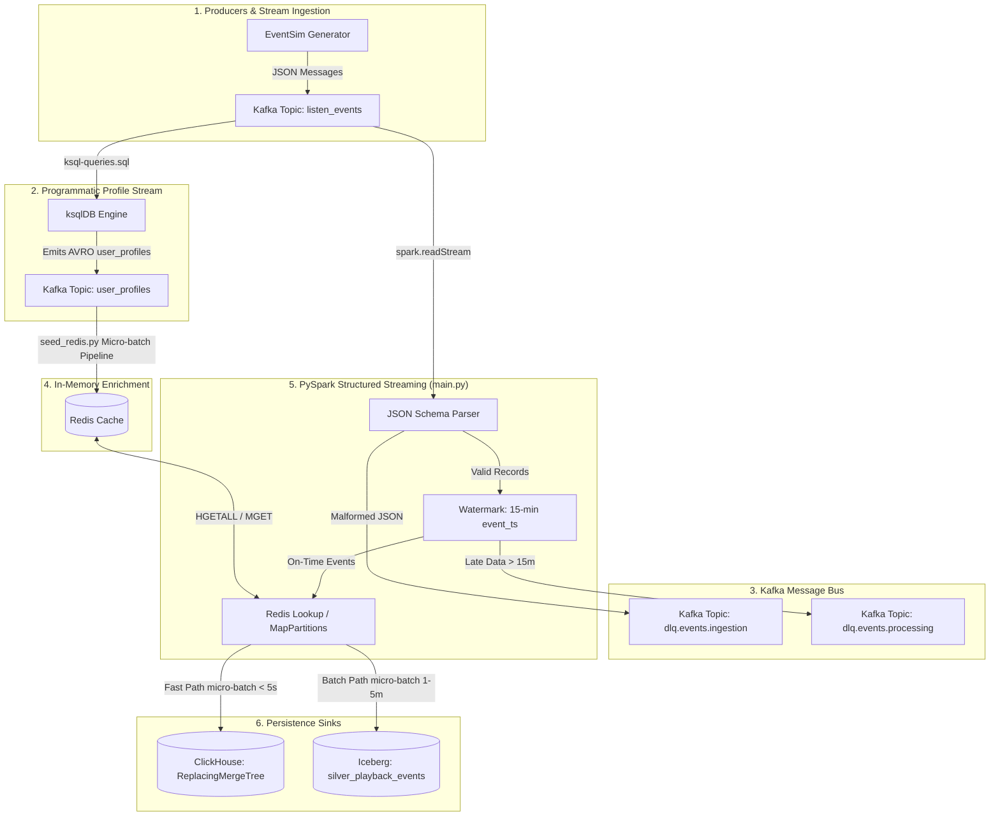

# System Specification: Real-Time Event Ingestion & Enrichment Pipeline (Streamify)

## 1. Overview & System Objectives
This specification defines the architecture, data models, streaming transformations, error handling (DLQ), and dual persistence layer for the **Streamify** real-time ingestion pipeline. The system models an enterprise streaming infrastructure (e.g., Spotify/Netflix) ingesting high-throughput playback events, enriching them in real-time using Redis profile/content caches, and persisting data to both a fast-path analytical store (ClickHouse) and an Iceberg Lakehouse.


---

## 2. Key Technology Stack & Infrastructure Mapping

| Layer | Component / Technology | Docker Service / Connection | Purpose |
| :--- | :--- | :--- | :--- |
| **Producer** | EventSim | `eventsim` | Simulates high-throughput streaming events (`listen_events`, `page_view_events`, `auth_events`). |
| **Message Broker** | Apache Kafka | `kafka:9092` / `localhost:9093` | Distributed log stream with 7-day retention. Partitioned by `Hash(userId)`. |
| **Stream Profile Generation** | ksqlDB Server | `ksqldb-server:8088` (`ksql-queries.sql`) | Programmatically creates the `user_profiles` Avro stream from incoming `listen_events`. |
| **Schema Registry** | Confluent Schema Registry | `schema-registry:8081` | Centralized schema management and Avro/JSON schema validation. |
| **Cache / Enrichment Store** | Redis 7 | `redis:6379` | In-memory lookup store for user profiles and content metadata. |
| **Stream Processing Engine** | PySpark Structured Streaming | `spark-connect:15002` / `spark-master:7077` | Reads Kafka topics, handles schema parsing, Redis enrichment lookups, watermarking, and dual-writes. |
| **Fast-Path Analytical Storage** | ClickHouse | `clickhouse:8123` / `localhost:8123` | Near real-time (< 5s latency) storage utilizing `ReplacingMergeTree` for idempotent deduplication. |
| **Transactional Lakehouse Storage** | Apache Iceberg (Polaris REST Catalog + MinIO S3) | Catalog: `polaris:8181`<br>Storage: `minio:9000` | Durable Parquet Lakehouse table (`silver_playback_events`) partitioned by date and country. |
| **Serving Layer** | Trino / Cube | External / Port 8088 (KSQL) | High-concurrency SQL query engine over Iceberg and ClickHouse. |

---

## 3. Data Flow & Pipeline Architecture



---

## 4. Topic Specifications & Data Models

### 4.1 Input Topics & Schemas

#### Topic: `listen_events`
- **Format**: JSON / Avro
- **Partition Key**: `Hash(userId)`
- **Schema Fields**:
  - `artist`: String (optional)
  - `song`: String (optional)
  - `duration`: Double
  - `ts`: Long (epoch milliseconds)
  - `auth`: String
  - `level`: String (`free` | `paid`)
  - `city`: String
  - `zip`: String
  - `state`: String
  - `userAgent`: String
  - `lon`: Double
  - `lat`: Double
  - `userId`: Long
  - `lastName`: String
  - `firstName`: String
  - `gender`: String (`M` | `F`)
  - `registration`: Long
  - `sessionId`: Integer
  - `itemInSession`: Integer

#### Topic: `user_profiles`
- **Format**: Avro / JSON
- **Partition Key**: `Hash(USERID)`
- **Redis Hash Mapping**: Key: `user:{USERID}`
  - `first_name`, `last_name`, `gender`, `city`, `state`, `zip_code`, `user_tier`, `country_code`, `event_time`, `ingestion_time`

### 4.2 Silver Enriched Data Model

Target table in Iceberg and ClickHouse: `silver_playback_events`

| Field Name | Type | Description | Primary / Merge Key Component |
| :--- | :--- | :--- | :--- |
| `event_id` | STRING | Deterministic UUID / SHA2 (`sha2(userId_sessionId_ts)`) | Yes (Merge Key) |
| `user_id` | BIGINT | Unique User identifier | |
| `content_id` | BIGINT | Identifier for track / video asset | |
| `event_ts` | TIMESTAMP | Event timestamp derived from `ts` | Yes (Merge & Partition Key) |
| `ingestion_ts` | TIMESTAMP | Ingestion timestamp in Kafka | |
| `region` | STRING | Geographic region (e.g. `us-east`) | Yes (ClickHouse Primary Key) |
| `country_code` | STRING | 2-letter country code derived from profile or IP | Yes (Iceberg Partition Key) |
| `device_type` | STRING | Device parsed from `userAgent` | |
| `session_id` | STRING | Session identifier | |
| `duration_ms` | INT | Duration in milliseconds | |
| `enriched_user_tier` | STRING | User tier from Redis (`free` / `premium` / `family`) | |
| `enriched_content_genre` | STRING | Content genre from Redis | |
| `_processing_time` | TIMESTAMP | Spark micro-batch processing timestamp | |

---

## 5. Micro-services & Core Component Specifications

### 5.1 Programmatic Profile Stream & Redis Seeding (`seed_redis.py` & `ksql-queries.sql`)
- **Objective**: Programmatically construct user profiles from the `listen_events` Kafka stream via ksqlDB (`ksql-queries.sql`), emit them as Avro records to `user_profiles`, and populate Redis asynchronously (`seed_redis.py`).
- **Behavior**:
  1. **ksqlDB Stream Transformation**: ksqlDB consumes `listen_events`, extracts user metadata (`userId`, `firstName`, `lastName`, `gender`, `city`, `state`, `zip`), formats `event_time` and `ingestion_time`, and streams Avro messages to `user_profiles`.
  2. **Micro-batch Consumption**: `seed_redis.py` consumes the `user_profiles` Avro topic using confluent-kafka (Batch limit: 1000 records or 1.0s window).
  3. **Hash Ingestion**: Maps Avro payloads to Redis hash data structure `user:{userId}`.
  4. **Async Pipeline**: Executes Redis commands via non-blocking Async IO (`aioredis` / `pipe.hset`).
  5. **Offset Management**: Manually commits Kafka offsets only after successful Redis flush.

### 5.2 Stream Processing & Enrichment Engine (`main.py`)
- **Objective**: Stream events from Kafka, parse payload, apply watermarking, enrich via Redis, and write to ClickHouse and Iceberg.
- **Transformation Steps**:
  1. **Kafka Extraction**: Read `listen_events` topic with `startingOffsets="latest"` and `failOnDataLoss="false"`.
  2. **Parsing & DLQ Routing**: Parse JSON payload. If `corrupt_record` or JSON schema mismatch occurs, route to `dlq.events.ingestion`.
  3. **Metadata Addition**: Add `_kafka_partition`, `_kafka_offset`, `_kafka_timestamp`, `event_id`, and `event_ts`.
  4. **Watermarking**: Define `.withWatermark("event_ts", "15 minutes")`.
  5. **Redis Lookup Enrichment**: For each micro-batch (or via custom Spark partition lookup):
     - Extract distinct `user_id` values per partition.
     - Batch fetch user profiles from Redis using `MGET` or Redis pipeline.
     - Join in-memory to add `enriched_user_tier`, `country_code`, and `enriched_content_genre`.
  6. **Dual Persistence Write**:
     - **Fast Path (ClickHouse)**: `foreachBatch` write using ClickHouse JDBC/HTTP driver. Max batch latency < 5s.
     - **Batch Path (Iceberg)**: `writeStream` to REST Catalog Iceberg table using `append` or `upsert` mode with 30s-60s triggers.

---

## 6. Persistence Storage Specifications

### 6.1 ClickHouse DDL Spec
```sql
CREATE TABLE IF NOT EXISTS streamify.silver_playback_events (
    event_id String,
    user_id UInt64,
    content_id UInt64,
    event_ts DateTime64(3),
    ingestion_ts DateTime64(3),
    region String,
    country_code String,
    device_type String,
    session_id String,
    duration_ms UInt32,
    enriched_user_tier String,
    enriched_content_genre String,
    _processing_time DateTime64(3)
) ENGINE = ReplacingMergeTree(event_ts)
ORDER BY (region, toYYYYMMDD(event_ts), event_id)
SETTINGS index_granularity = 8192;
```

### 6.2 Iceberg DDL Spec
```sql
CREATE TABLE IF NOT EXISTS lakehouse.streamify.silver_playback_events (
    event_id STRING,
    user_id BIGINT,
    content_id BIGINT,
    event_ts TIMESTAMP,
    ingestion_ts TIMESTAMP,
    region STRING,
    country_code STRING,
    device_type STRING,
    session_id STRING,
    duration_ms INT,
    enriched_user_tier STRING,
    enriched_content_genre STRING,
    _processing_time TIMESTAMP
)
USING iceberg
PARTITIONED BY (days(event_ts), country_code)
TBLPROPERTIES (
    'write.format.default'='parquet',
    'write.parquet.compression-codec'='zstd',
    'write.parquet.compression-level'='7',
    'write.target-file-size-bytes'='536870912',
    'write.distribution-mode'='hash',
    'write.local.sort.by'='user_id, content_id',
    'history.expire.max-snapshot-age-ms'='604800000'
);
```

---

## 7. Gap Analysis: Current Code vs. Specification

| Feature / Requirement | Current Status in Codebase | Action Required |
| :--- | :--- | :--- |
| **Kafka Ingestion** | Implemented in `main.py` for `listen_events` | Extend to support multiple event types and configure failover parameters. |
| **Redis Cache Seeding** | Implemented in `seed_redis.py` | Operational for `user_profiles`. Needs metadata fallback for missing keys. |
| **Dead Letter Queue (DLQ)** | Missing | Implement DLQ routing for corrupt JSON payloads and failed micro-batches. |
| **Watermarking & Late Data** | Missing | Add `withWatermark("event_ts", "15 minutes")` and late data filtering/routing. |
| **Redis Enrichment Join** | Missing in `main.py` | Implement partition-level Redis cache lookup inside `main.py` micro-batches. |
| **ClickHouse Fast-Path Sink** | Missing in `main.py` | Add ClickHouse JDBC/HTTP `foreachBatch` writer with `ReplacingMergeTree`. |
| **Iceberg Silver Sink** | Partially implemented (`bronze_listen_events`) | Upgrade to `silver_playback_events` with proper partition specification and metadata fields. |

---

## 8. Verification & Test Plan

1. **Kafka Ingestion Test**: Produce sample messages into `listen_events` via EventSim and verify Spark extracts messages cleanly.
2. **DLQ Failure Test**: Send corrupt JSON into `listen_events` topic and verify it lands in `dlq.events.ingestion`.
3. **Redis Lookup Test**: Seed test keys into Redis (`user:1001`), stream an event for `userId: 1001`, and verify `enriched_user_tier` is correctly populated.
4. **ClickHouse Fast-Path Test**: Query ClickHouse `silver_playback_events` within 5 seconds of stream execution and verify zero duplicates across repeated runs (`ReplacingMergeTree`).
5. **Iceberg Partitioning Test**: Verify S3 layout (`s3://lakehouse/streamify/silver_playback_events/data/event_ts_day=.../country_code=.../`).
