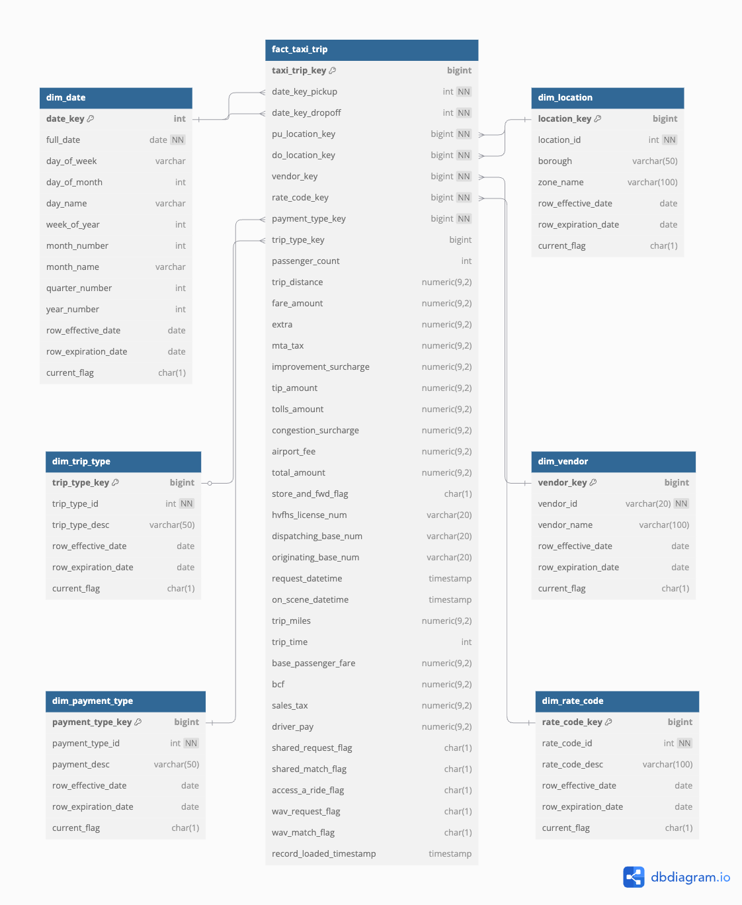

# Data Model


## Business Process and Grain

**Business Process:** The passenger-transportation workflow for for-hire vehicles, from ride request or hail through drop-off and final payment, capturing operational and financial metrics at each step.

**Grain:** One row per individual trip (the lowest level of detail representing each ride).

This fact table will contain metrics such as fare amount, tip amount, total amount, distance traveled, and passenger count. Each fact record links to dimension tables describing the `who`, `what`, `when`, and `where` of each trip.

## Dimension Overviews
Below is an **entity-by-entity** description of the **NYC Taxi & FHV data warehouse** schema in a **Kimball-style** star schema.

---

## Fact Table

#### `**fact_taxi_trip**`
- **Purpose**:  
  This table captures **all trip-related metrics and events** for `Yellow Taxi`, `Green Taxi`, and `High-Volume FHV` (e.g., Uber, Lyft). Each row represents a *single completed trip* from pick-up to drop-off, including financial details (fares, tips, surcharges) and operational flags (e.g., shared rides, wheelchair accessibility). Analysts can use it to measure revenue, trip counts, service usage patterns, and driver payouts.

- **Key Attributes**:
  - **date_key_pickup, date_key_dropoff**: Foreign keys to the date dimension indicating when the trip started and ended.
  - **pu_location_key, do_location_key**: Foreign keys to the location dimension, referencing pickup and drop-off zones.
  - **vendor_key**: Foreign key to the vendor dimension (e.g., Verifone, Creative Mobile Technologies, Lyft/Uber).
  - **rate_code_key**: Foreign key to the rate code dimension (e.g., Standard, JFK, Newark).
  - **payment_type_key**: Foreign key to the payment type dimension (e.g., Credit Card, Cash).
  - **trip_type_key**: (Optional) Foreign key indicating Street-Hail vs. Dispatch (used primarily for Green/HV trips).
  - **passenger_count**: Number of passengers (driver-entered or system-reported).
  - **trip_distance / trip_miles**: Distance traveled, in miles (labeled differently across data sources).
  - **fare_amount / base_passenger_fare**: Meter-based fare (Yellow/Green) or base fare (HVFHV).
  - **tolls_amount**: Total tolls paid during the trip.
  - **tip_amount / tips**: Total tip paid by passenger (credit card tips are automatically recorded; cash tips may not be included).
  - **congestion_surcharge**: Additional surcharge applied in congested zones.
  - **airport_fee**: Airport pickup/drop-off fee (where applicable).
  - **driver_pay**: Net driver payout (HVFHV data), excluding commissions and fees.
  - **shared_request_flag, shared_match_flag**: Indicate passenger’s willingness to share (Y/N) and whether the ride was actually shared.
  - **wav_request_flag, wav_match_flag**: Indicate if a wheelchair-accessible vehicle was requested and if the trip was served by one.
  - **access_a_ride_flag**: Mark MTA Access-A-Ride trips (Y/N).
  - **store_and_fwd_flag**: (Yellow/Green) Indicates if the trip record was temporarily stored before transmitting.
  - **record_loaded_timestamp**: Audit column noting when the record was loaded.

> While not all fields apply to every dataset, storing them in a unified fact table (with NULLs for non-applicable rows) simplifies downstream analytics.

---

## Dimension Tables

#### `dim_date`
- **Purpose**:  
  Provides **calendar-related attributes** (day, month, quarter, year) for any date used in the warehouse. This dimension is central for time-series analysis, enabling grouping of trips by day, month, quarter, and year.

- **Key Attributes**:
  - **date_key**: Integer surrogate key in `YYYYMMDD` format (e.g., `20250117`).
  - **full_date**: Actual date value (e.g., `2025-01-17`).
  - **day_of_week, day_of_month, day_name, week_of_year, month_number, month_name, quarter_number, year_number**: Various calendar breakdowns.
  - **row_effective_date, row_expiration_date, current_flag**: Columns for handling Slowly Changing Dimensions (SCD2), if needed.

---

#### `dim_location`
- **Purpose**:  
  Stores **TLC zone** information (e.g., Manhattan – Midtown, Queens – JFK, etc.) for both pickup and drop-off. By centralizing location data, analysts can see which borough or zone a ride starts/ends in, facilitating geographic and zone-based analytics.

- **Key Attributes**:
  - **location_key**: Surrogate key for location dimension.
  - **location_id**: Original TLC zone identifier (e.g., 132, 230).
  - **borough**: Borough name (Manhattan, Queens, etc.).
  - **zone_name**: Zone description (e.g., “JFK Airport,” “Upper East Side”).
  - **row_effective_date, row_expiration_date, current_flag**: SCD2 columns for tracking zone redefinitions or boundary changes.

---

#### `dim_vendor`
- **Purpose**:  
  Identifies the **company or provider** of the ride, such as “Verifone,” “Creative Mobile Technologies,” “Uber,” “Lyft,” etc. Helps separate rides by technology provider or brand.

- **Key Attributes**:
  - **vendor_key**: Surrogate key for vendor dimension.
  - **vendor_id**: Numeric or alphanumeric code used in source data (e.g., `1`, `2`, `HV0003`).
  - **vendor_name**: Descriptive name (e.g., “Verifone,” “Uber”).
  - **row_effective_date, row_expiration_date, current_flag**: SCD2 columns for tracking changes or merges over time.

---

#### `dim_rate_code`
- **Purpose**:  
  Describes **tariff types or negotiated rates** used during the trip (e.g., Standard Rate, JFK Rate, Newark Rate). Useful for analyzing how different rate structures affect fare revenue.

- **Key Attributes**:
  - **rate_code_key**: Surrogate key for rate code dimension.
  - **rate_code_id**: Numeric code from source (1 = Standard, 2 = JFK, etc.).
  - **rate_code_desc**: Human-readable description (e.g., “Standard Rate,” “JFK,” “Group Ride”).
  - **row_effective_date, row_expiration_date, current_flag**: SCD2 columns for tracking the introduction or retirement of rate codes.

---

#### `dim_payment_type`
- **Purpose**:  
  Distinguishes **payment methods** (credit card, cash, no-charge, dispute). Allows analysis of passenger behavior regarding payment preferences, tip correlations, and potential fraud or dispute rates.

- **Key Attributes**:
  - **payment_type_key**: Surrogate key for payment type dimension.
  - **payment_type_id**: Numeric code (1 = Credit card, 2 = Cash, etc.).
  - **payment_desc**: Descriptive label (e.g., “Credit,” “Cash,” “No charge”).
  - **row_effective_date, row_expiration_date, current_flag**: SCD2 columns for capturing changes or additions in payment types (e.g., new payment solutions).

---

#### `dim_trip_type`
- **Purpose**:  
  Categorizes whether a **Green Taxi or HVFHV** trip was a **street-hail or dispatch**. While Yellow Taxis are always “hail,” Green Taxis and FHV rides may vary in how they’re initiated. Helps to analyze distribution of dispatch vs. hail requests.

- **Key Attributes**:
  - **trip_type_key**: Surrogate key for trip type dimension.
  - **trip_type_id**: Numeric code (1 = Street-hail, 2 = Dispatch).
  - **trip_type_desc**: Description (e.g., “Street-hail,” “App Dispatch”).
  - **row_effective_date, row_expiration_date, current_flag**: SCD2 columns for capturing changes or expansions in trip classification.


# Model



```sql
Project "NYC Taxi & FHV Data Warehouse" {
  database_type: "Snowflake" // or PostgreSQL, BigQuery, etc.
  note: "Comprehensive Kimball star schema for NYC Taxi & FHV data"
}

//////////////////////////////////
// DIMENSIONS
//////////////////////////////////

Table dim_date {
  date_key             int        [pk, note: "e.g., 20230201 for 2023-02-01"]
  full_date            date       [not null]
  day_of_week          varchar
  day_of_month         int
  day_name             varchar
  week_of_year         int
  month_number         int
  month_name           varchar
  quarter_number       int
  year_number          int

  // SCD2 columns (optional usage)
  row_effective_date   date
  row_expiration_date  date
  current_flag         char(1)    [default: "Y"]
}

Table dim_location {
  location_key         bigint     [pk]
  location_id          int        [not null, note: "TLC Zone ID from PULocationID or DOLocationID"]
  borough              varchar(50)
  zone_name            varchar(100)

  // SCD2 columns
  row_effective_date   date
  row_expiration_date  date
  current_flag         char(1)    [default: "Y"]
}

Table dim_vendor {
  vendor_key           bigint     [pk]
  vendor_id            varchar(20) [not null, note: "e.g., 1, 2, HV0003, etc."]
  vendor_name          varchar(100)
  
  // SCD2 columns
  row_effective_date   date
  row_expiration_date  date
  current_flag         char(1)    [default: "Y"]
}

Table dim_rate_code {
  rate_code_key        bigint     [pk]
  rate_code_id         int        [not null, note: "1=Standard,2=JFK,3=Newark,..."]
  rate_code_desc       varchar(100)
  
  // SCD2 columns
  row_effective_date   date
  row_expiration_date  date
  current_flag         char(1)    [default: "Y"]
}

Table dim_payment_type {
  payment_type_key     bigint     [pk]
  payment_type_id      int        [not null, note: "1=Credit,2=Cash,3=No charge, etc."]
  payment_desc         varchar(50)
  
  // SCD2 columns
  row_effective_date   date
  row_expiration_date  date
  current_flag         char(1)    [default: "Y"]
}

Table dim_trip_type {
  trip_type_key        bigint     [pk]
  trip_type_id         int        [not null, note: "1=Street-hail,2=Dispatch (Green)"]
  trip_type_desc       varchar(50)
  
  // SCD2 columns
  row_effective_date   date
  row_expiration_date  date
  current_flag         char(1)    [default: "Y"]
}


//////////////////////////////////
// FACT TABLE
//////////////////////////////////

Table fact_taxi_trip {
  taxi_trip_key        bigint     [pk, note: "Surrogate key for the fact table"]

  //------------------------------
  // Foreign Keys
  //------------------------------
  date_key_pickup      int        [not null, note: "FK to dim_date.date_key"]
  date_key_dropoff     int        [not null, note: "FK to dim_date.date_key"]
  pu_location_key      bigint     [not null, note: "FK to dim_location.location_key"]
  do_location_key      bigint     [not null, note: "FK to dim_location.location_key"]
  vendor_key           bigint     [not null, note: "FK to dim_vendor.vendor_key"]
  rate_code_key        bigint     [not null, note: "FK to dim_rate_code.rate_code_key"]
  payment_type_key     bigint     [not null, note: "FK to dim_payment_type.payment_type_key"]
  trip_type_key        bigint     [note: "FK to dim_trip_type.trip_type_key (Green/HV only)"]

  //------------------------------
  // Common Measures & Attributes
  //------------------------------
  passenger_count            int
  trip_distance              numeric(9,2)  [note: "Yellow/Green label for distance"]
  fare_amount                numeric(9,2)  [note: "Taximeter fare or unified base fare"]
  extra                      numeric(9,2)  [note: "$0.50, $1 rush hour/overnight, etc. (Yellow/Green)"]
  mta_tax                    numeric(9,2)
  improvement_surcharge      numeric(9,2)
  tip_amount                 numeric(9,2)  [note: tips or credit card tips]
  tolls_amount               numeric(9,2)  [note: total tolls paid in the trip]
  congestion_surcharge       numeric(9,2)
  airport_fee                numeric(9,2)
  total_amount               numeric(9,2)  [note: total charged to passenger, not including cash tip]

  //------------------------------
  // Additional Y/G field
  //------------------------------
  store_and_fwd_flag         char(1)      [note: "Y/N if trip was stored before forward"]

  //------------------------------
  // HVFHV-Specific Data
  //------------------------------
  hvfhs_license_num          varchar(20)  [note: "HVFHS base license # (Uber, Lyft, etc.)"]
  dispatching_base_num       varchar(20)  [note: "Base that dispatched the trip"]
  originating_base_num       varchar(20)  [note: "Base that received the original request"]
  request_datetime           timestamp    [note: "When passenger requested the ride"]
  on_scene_datetime          timestamp    [note: "When driver arrived (Accessible Vehicles only)"]
  trip_miles                 numeric(9,2) [note: HVFHV label for distance, unify if desired]
  trip_time                  int          [note: total seconds for passenger trip (HVFHV)"]
  base_passenger_fare        numeric(9,2) [note: HVFHV fare before tolls/tips/taxes]
  bcf                        numeric(9,2) [note: Black Car Fund contribution]
  sales_tax                  numeric(9,2) [note: NYS sales tax portion]

  //------------------------------
  // HVFHV Flags & Driver Pay
  //------------------------------
  driver_pay                 numeric(9,2) [note: net driver pay, excluding tolls/tips]
  shared_request_flag        char(1)     [note: "Y/N: passenger consented to a shared/pooled ride"]
  shared_match_flag          char(1)     [note: "Y/N: passenger actually shared the ride w/ another passenger"]
  access_a_ride_flag         char(1)     [note: "Y/N: MTA Access-a-Ride trip"]
  wav_request_flag           char(1)     [note: "Y/N: wheelchair-accessible vehicle requested"]
  wav_match_flag             char(1)     [note: "Y/N: trip occurred in a WAV"]

  //------------------------------
  // Auditing
  //------------------------------
  record_loaded_timestamp    timestamp   [default: "CURRENT_TIMESTAMP"]
}

//////////////////////////////////
// RELATIONSHIPS
//////////////////////////////////

// fact_taxi_trip → dim_date
Ref: fact_taxi_trip.date_key_pickup  > dim_date.date_key
Ref: fact_taxi_trip.date_key_dropoff > dim_date.date_key

// fact_taxi_trip → dim_location
Ref: fact_taxi_trip.pu_location_key  > dim_location.location_key
Ref: fact_taxi_trip.do_location_key  > dim_location.location_key

// fact_taxi_trip → dim_vendor
Ref: fact_taxi_trip.vendor_key       > dim_vendor.vendor_key

// fact_taxi_trip → dim_rate_code
Ref: fact_taxi_trip.rate_code_key    > dim_rate_code.rate_code_key

// fact_taxi_trip → dim_payment_type
Ref: fact_taxi_trip.payment_type_key > dim_payment_type.payment_type_key

// fact_taxi_trip → dim_trip_type
Ref: fact_taxi_trip.trip_type_key    > dim_trip_type.trip_type_key