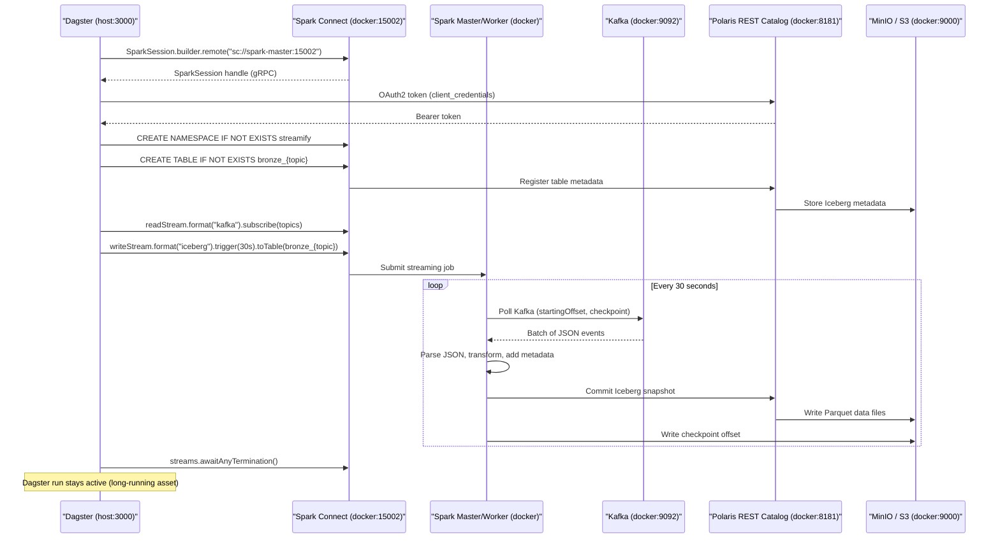
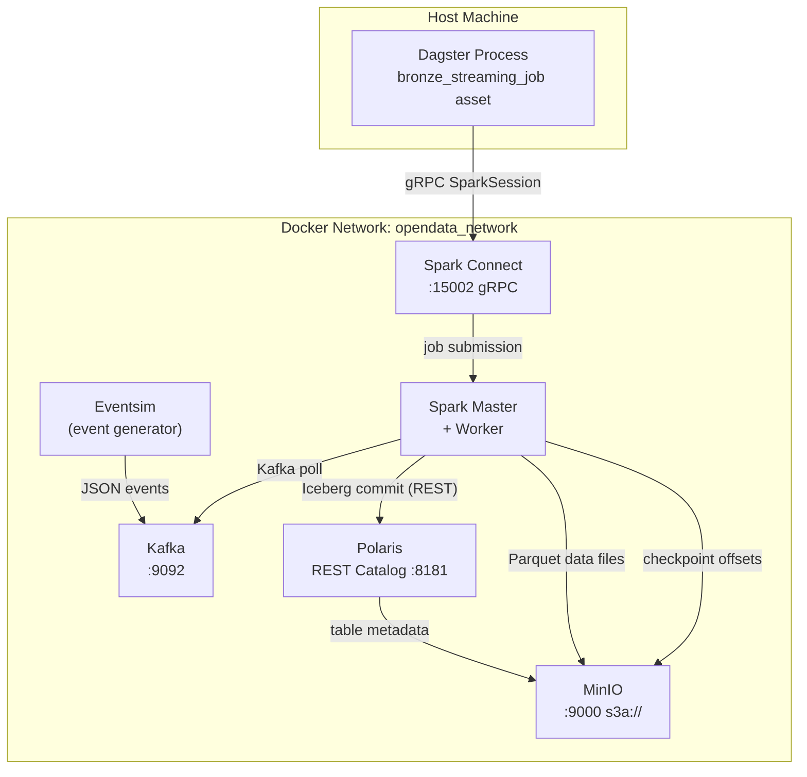
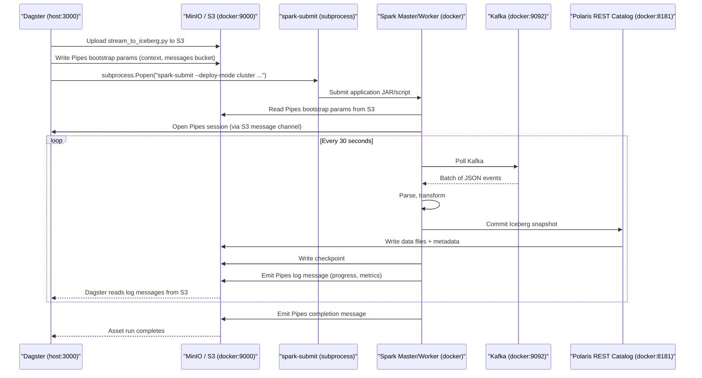
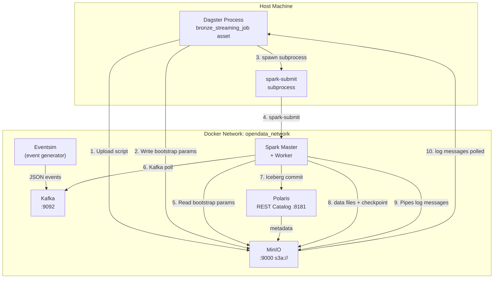

# Spark Streaming Orchestration: Design Options

This document compares the two viable approaches for orchestrating a Spark Structured Streaming
job from Dagster in the Streamify pipeline. The current implementation uses **Option A (Spark Connect)**.
Option B (Dagster Pipes) is documented as the considered alternative.

---

## Option A — Spark Connect (Current Implementation)

### How it works

Dagster runs a native PySpark asset. The `SparkConnectResource` opens a gRPC connection to the
Spark Connect server running in Docker. The streaming query (`writeStream`) executes on the remote
Spark cluster, but the Python driver code runs inside the Dagster process.



### Architecture diagram



### Key characteristics

| Property | Detail |
|----------|--------|
| **Driver location** | Dagster process (host machine) |
| **Execution** | Remote Spark cluster via gRPC |
| **Code style** | Native PySpark API — `readStream`, `writeStream`, `toTable()` |
| **Error handling** | Full Python stack traces propagated back to Dagster |
| **Resource management** | Dagster `ConfigurableResource` injects session + config |
| **Dagster run lifecycle** | Stays active indefinitely; must be cancelled to stop streaming |
| **Restart behaviour** | Re-materialise asset → Spark resumes from MinIO checkpoint |
| **External scripts** | None — all logic is in `assets.py` |
| **External dependencies for messaging** | None — gRPC only |

### Relevant code

**`resources.py`** — creates the `SparkSession` via `SparkSession.builder.remote(...)`:
```python
builder = SparkSession.builder.appName(app_name)
if spark_remote:
    builder = builder.remote(spark_remote)   # sc://spark-master:15002
return builder.config(...).getOrCreate()
```

**`assets.py`** — writes stream directly from the Dagster asset:
```python
df_stream.writeStream \
    .format("iceberg") \
    .outputMode("append") \
    .trigger(processingTime="30 seconds") \
    .option("checkpointLocation", checkpoint_location) \
    .option("fanout-enabled", "true") \
    .toTable(table_name)

session.streams.awaitAnyTermination()  # blocks the Dagster run
```

---

## Option B — Dagster Pipes + spark-submit (Alternative, Not Implemented)

### How it works

Dagster Pipes is a protocol for launching and monitoring **external processes** from a Dagster asset.
For Spark, the pattern is:

1. Dagster uploads a Python script to S3 (MinIO)
2. Dagster calls `spark-submit` as a subprocess, passing Pipes bootstrap parameters as env vars
3. The Spark job runs as a standalone process on the cluster
4. The job sends logs and metadata back to Dagster via S3-based message passing
5. The Dagster asset completes (or stays open) while the external job runs independently



### Architecture diagram



### Key characteristics

| Property | Detail |
|----------|--------|
| **Driver location** | Spark cluster (inside Docker) |
| **Execution** | Independent OS process (`spark-submit`) |
| **Code style** | External Python script with `PipesContext` inside |
| **Error handling** | Errors arrive via S3 message channel; no direct stack traces |
| **Resource management** | CLI args passed via `spark-submit` flags; env vars for Pipes |
| **Dagster run lifecycle** | Dagster asset can complete while Spark job runs on (fire-and-forget) |
| **Restart behaviour** | Must re-upload script + re-submit; checkpoint still works |
| **External scripts** | Requires standalone `spark_scripts/stream_to_iceberg.py` |
| **External dependencies for messaging** | S3 bucket for Pipes message passing (`dagster-pipes`) |

### What the Pipes code would look like

The external script would need a `PipesContext` wrapper:

```python
# spark_scripts/stream_to_iceberg.py  (hypothetical)
from dagster_pipes import open_dagster_pipes

def main():
    with open_dagster_pipes() as pipes:
        spark = SparkSession.builder.appName("StreamToIceberg").getOrCreate()

        # ... same Kafka → Iceberg streaming logic ...

        def on_batch_complete(batch_df, batch_id):
            pipes.log.info(f"Batch {batch_id} committed")
            pipes.report_asset_materialization(
                metadata={"batch_id": batch_id, "records": batch_df.count()}
            )

        query = (
            parsed_df.writeStream
            .format("iceberg")
            .trigger(processingTime="30 seconds")
            .foreachBatch(on_batch_complete)
            .start()
        )

        query.awaitTermination()

if __name__ == "__main__":
    main()
```

The Dagster asset side:

```python
# defs/streaming_assets.py  (hypothetical)
@dg.asset
def bronze_streaming_job(context, s3: S3Resource):
    script_path = upload_script_to_s3(s3, "spark_scripts/stream_to_iceberg.py")

    with open_pipes_session(context, ...) as session:
        subprocess.Popen([
            "spark-submit",
            "--master", "spark://spark-master:7077",
            "--conf", f"spark.sql.catalog.{catalog}=org.apache.iceberg.spark.SparkCatalog",
            # ... many more --conf flags ...
            script_path,
            *session.get_bootstrap_params_as_env_vars()
        ])
        # Dagster asset waits for Pipes completion message
        yield from session.get_results()
```

---

## Side-by-Side Comparison

| Dimension | Option A: Spark Connect | Option B: Dagster Pipes |
|-----------|------------------------|------------------------|
| **Implementation complexity** | Low — one Python file, native PySpark API | High — separate script, Pipes protocol, S3 message channel |
| **Operational moving parts** | Dagster + Spark Connect + Spark cluster | Dagster + subprocess + spark-submit + S3 + Spark cluster |
| **Error visibility** | Full Python tracebacks in Dagster logs | Errors must be serialised through S3 messages |
| **Config passing** | `ConfigurableResource` injection | CLI args + env vars to subprocess |
| **Dagster run lifecycle** | Blocking (run stays open while stream is alive) | Non-blocking option available (fire-and-forget) |
| **Portability** | Requires Spark Connect (Spark 3.4+) | Works with any Spark cluster (older versions too) |
| **Local development** | One process, easy to debug with breakpoints | Subprocess is harder to debug interactively |
| **Suitable for 24/7 streaming** | Yes — but Dagster run is tied to stream lifetime | Yes — and Dagster run can complete independently |
| **Script management** | No separate scripts needed | External scripts must be versioned, uploaded, managed |
| **Dependency on external bucket** | No | Yes — S3 bucket required for Pipes messages |
| **Code co-location** | All logic in `assets.py` | Split across `assets.py` + `spark_scripts/*.py` |

---

## Why Spark Connect Was Chosen

For this stack, Spark Connect wins on **simplicity and debuggability** at the cost of a
long-running Dagster run:

1. **No subprocess plumbing** — the streaming logic lives in one file alongside the asset definition. There is no external script to upload, version, or manage.

2. **Direct error propagation** — if the Spark job throws an exception, it surfaces directly in Dagster with a full Python traceback. With Pipes, errors travel through S3 messages and can be harder to correlate.

3. **Resource injection** — Polaris credentials, Kafka addresses, and checkpoint paths are injected by Dagster's resource system. With `spark-submit`, every config value becomes a `--conf` CLI flag.

4. **Spark Connect is already in the stack** — the `spark-connect` service is already defined in `docker-compose.yml` for batch use. Adding streaming on top costs zero additional infrastructure.

5. **The long-running run is acceptable** — for a local/development data platform with manual oversight, a Dagster run that stays open while streaming is not a problem. The run can be cancelled and restarted, and checkpointing ensures no data loss.

### When Dagster Pipes would be the better choice

- **Multi-cluster or remote clusters** (EMR, Databricks, GKE) where Spark Connect isn't available or isn't the preferred connection mode
- **True fire-and-forget streaming** where you want the Dagster run to complete immediately and the Spark job to run as a standalone daemon
- **Older Spark versions** (< 3.4) that don't have Spark Connect
- **Independent failure domains** — if you need the streaming job to survive a Dagster restart without being tied to a Dagster run

---

## References

- [Spark Connect Overview](https://spark.apache.org/docs/latest/spark-connect-overview.html)
- [Dagster Pipes Documentation](https://docs.dagster.io/guides/build/external-pipelines/using-dagster-pipes)
- [PySpark + Dagster Pipes Guide](https://docs.dagster.io/guides/build/external-pipelines/pyspark-pipeline)
- [Spark Structured Streaming + Iceberg](https://iceberg.apache.org/docs/latest/spark-writes/#streaming-writes)
