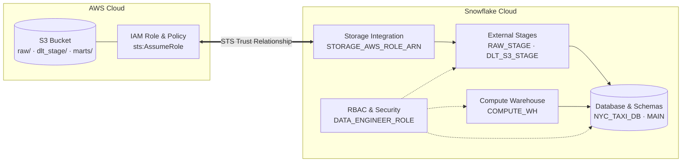

# Snowflake & AWS S3 Infrastructure Provisioning (Terraform)

This Terraform module automates the end-to-end cloud infrastructure provisioning required by the **NYC TLC Data Platform** in production, setting up a secure, cross-account AWS S3 storage integration with Snowflake.

## 🏗️ Architecture Overview



## What This Module Creates

### AWS Cloud Resources

- **S3 Bucket (`s3.tf`)**: Secure bucket with AES-256 server-side encryption, versioning, and public access blocks.
- **Folder Partitions**: Automatically initializes `raw/`, `dlt_stage/`, `state/`, and `marts/` folder prefixes.
- **IAM Role & Policy (`iam.tf`)**: Fine-grained IAM policy granting Snowflake permission to perform `s3:GetObject`, `s3:PutObject`, `s3:ListBucket`, and `s3:DeleteObject` across allowed stage prefixes.
- **STS Trust Policy**: Automatically associates Snowflake's `STORAGE_AWS_IAM_USER_ARN` and `STORAGE_AWS_EXTERNAL_ID` via STS AssumeRole.

### Snowflake Cloud Resources

- **Warehouse (`snowflake-database.tf`)**: `COMPUTE_WH` virtual warehouse configured with auto-suspend and auto-resume.
- **Database & Schemas (`snowflake-database.tf`)**: Creates the target database (`NYC_TAXI_DB`) with 7-day time travel retention and `MAIN` schema.
- **RBAC & Security (`snowflake-users-roles.tf`)**:
  - `DATA_ENGINEER_ROLE`: Custom account role with least-privilege grants across database, schemas, warehouse, stages, and integrations.
  - `DATA_ENGINEER`: Service user assigned to `DATA_ENGINEER_ROLE` and default warehouse.
- **Storage Integration (`snowflake-storage-integration.tf`)**: Secure S3 storage integration (`opendata_stack_s3_integration`).
- **External Stages (`snowflake-stages.tf`)**:
  - `RAW_STAGE`: External stage mapped to `s3://<bucket>/raw/` for CSV raw trip files.
  - `DLT_S3_STAGE`: External stage mapped to `s3://<bucket>/dlt_stage/` for dlt Parquet pipeline ingestion.


## Setup & Deployment Instructions

> The module automatically creates the AWS S3 bucket, IAM role, Snowflake database, warehouse, RBAC role, user, storage integration, external stages, and updates the IAM assume-role trust policy via the local-exec provisioner.

### Prerequisites
1. **AWS CLI** configured (`aws configure` with Administrator or IAM permissions).
2. **Terraform CLI** installed.
3. **Snowflake Account** with `ACCOUNTADMIN` credentials.

Terraform variables are mapped using `TF_VAR_*` environment variables. A template is provided in `.env.example`.

The base credentials and environment variables are actually defined in the NYC `data_platform` project root (`dagster-workspace/projects/data_platform/`).

```bash
# export variables & source variables 
cp .env.example .env

# Initialize Terraform providers
terraform init

# Plan and preview changes
terraform plan

# Apply infrastructure
terraform apply

# Display output variables
terraform output

# Destroy all resources
terraform destroy
```